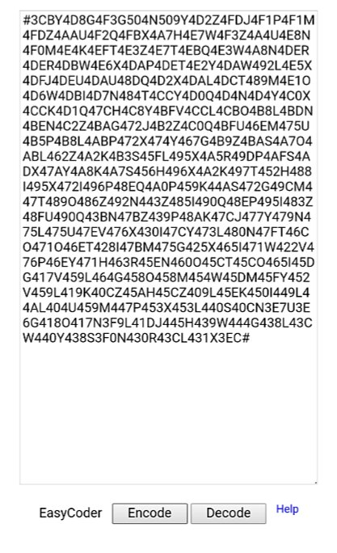

# EasyCoder

EasyCoder is an encoding-decoding app for your instant messenger (IM), such as WhatsApp or WeChat. It can convert a readable message to an unreadable codeblock, or vice versa.

== Encoding and Sending ==

1. Type a message within 200 characters in EasyCoder.
2. Press "Encode" button to convert the message to a codeblock.
3. Select all the codeblock, including two # tags, and cut it.
4. Paste it to your IM and send it to your friend.

== Receiving and Decoding ==

1. Receive a codeblock in your IM from your friend.
2. Select all the codeblock, including two # tags, and copy it.
3. Paste it to EasyCoder.
4. Press "Decode" button to generate a message.

